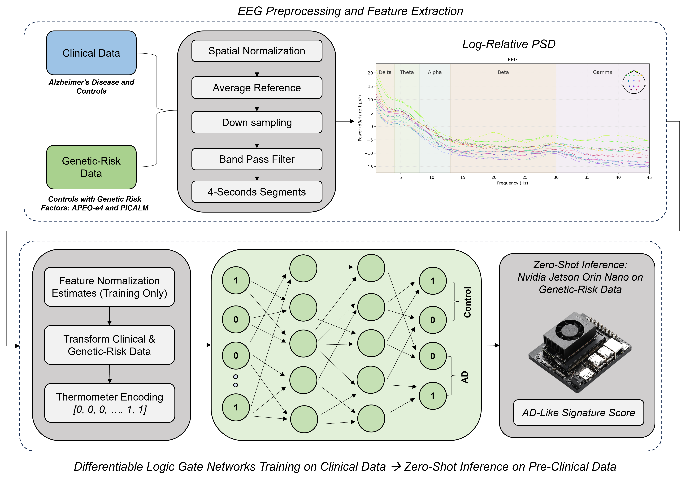
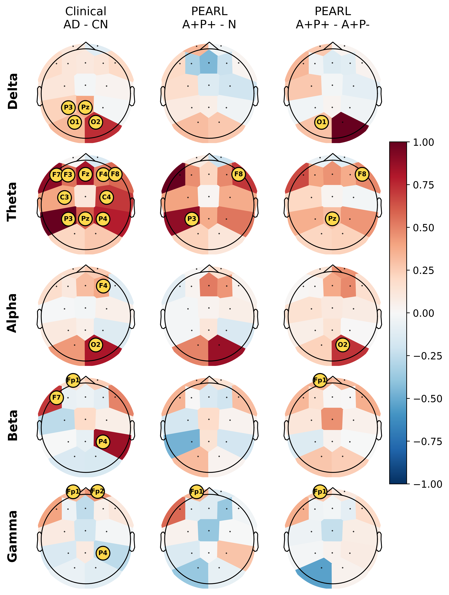

# Cross-Cohort Transfer of Clinical Alzheimer's EEG Signatures to Preclinical APOE-ε4 and PICALM rs3851179 Risk Carriers Using Differentiable Logic Gate Networks

Code and analysis pipeline for the paper above.

A Diff-Logic model is trained on clinical resting-state EEG to separate AD from cognitively
normal (CN) participants, then applied **without retraining** to the PEARL cohort. The model
output is treated as an *AD-like EEG signature score* and compared across the three genetic-risk
groups: neutral-risk non-carriers (N), APOE-ε4-only carriers (A+P-), and dual APOE-ε4 / PICALM GG
carriers (A+P+). Scores are research outputs and are **not** clinical diagnoses.



## Pipeline

1. Harmonized preprocessing of the clinical source cohort and PEARL, restricted to the strict
   15-channel overlap and average-referenced over the same 15 channels.
2. Welch PSD extraction (1-45 Hz), converted to log-relative band power.
3. Subject-stratified training of Diff-Logic and matched PyTorch baselines (MLP, 1D-CNN, Transformer)
   at a fixed ~250k-parameter budget.
4. Zero-shot inference on PEARL (and, exploratorily, on the DS007427 PSEN1-E280A cohort).
5. Group statistics: Holm-corrected contrasts, permutation tests, age/sex-adjusted regression.
6. Interpretation: integrated-gradient relevance maps compared between source and target.

## Installation

```bash
python -m venv .venv && source .venv/bin/activate
pip install --upgrade pip
pip install -r requirements.txt
```

Diff-Logic runs on PyTorch; for GPU support install the PyTorch build matching your CUDA version.

## Data Layout

Raw EEG is **not** included in this repository. Place datasets locally as:

```text
datasets/
  ALZ_FTD/     # clinical source cohort (AD / FTD / CN)
  PEARL/       # genetic-risk target cohort
  DS007427/    # PSEN1-E280A cohort (exploratory)
```

Common 15-channel montage used throughout:
`Fp1, Fp2, F7, F3, Fz, F4, F8, C3, Cz, C4, P3, Pz, P4, O1, O2`

`datasets/`, `outputs/`, and `logs/` are git-ignored.

## Quickstart

Run from the repository root with `PYTHONPATH=src`. The commands below reproduce the primary
45 Hz, 250k-parameter benchmark analysis reported in the manuscript.

```bash
# 1. Preprocess  ->  datasets/processed/{ALZ_FTD,PEARL,DS007427}/
PYTHONPATH=src python src/preprocessing.py

# 2. PSD features  ->  datasets/features_psd_45hz/
PYTHONPATH=src python src/feature_extraction_psd.py \
  --datasets ALZ_FTD PEARL DS007427 --output-dir datasets/features_psd_45hz

# 3. Train Diff-Logic (5 seeds) + zero-shot transfer  ->  outputs/difflogic_45hz/benchmark_250k_psd/
for seed in 1 2 3 4 5; do
  PSD_FEATURE_DIR=datasets/features_psd_45hz PYTHONPATH=src python src/train_difflogic.py \
    --model-kind difflogic_medium --output-name benchmark_250k_psd \
    --target-datasets PEARL DS007427 --seed "$seed" \
    --epochs 200 --patience 50 --output-dir outputs/difflogic_45hz
done

# Matched neural baselines at the same parameter budget
for kind in mlp_250k conv1d_250k transformer_250k; do
  for seed in 1 2 3 4 5; do
    PSD_FEATURE_DIR=datasets/features_psd_45hz PYTHONPATH=src python src/train_difflogic.py \
      --model-kind "$kind" --output-name "${kind}_psd" --seed "$seed" \
      --epochs 200 --patience 50 --output-dir outputs/difflogic_45hz
  done
done

# 4. Summaries, group statistics, manuscript tables
PYTHONPATH=src python src/summarize_difflogic_runs.py \
  --run-name benchmark_250k_psd --output-dir outputs/difflogic_45hz
PYTHONPATH=src python src/analyze_pearl_covariates.py \
  --summary-dir outputs/difflogic_45hz/benchmark_250k_psd/summary
PYTHONPATH=src python src/pearl_permutation_tests.py
PYTHONPATH=src python src/make_45hz_benchmark_tables.py \
  --difflogic-dir outputs/difflogic_45hz \
  --output-dir outputs/model_comparison_tables_45hz_benchmark_250k

# 5. Interpretation  ->  integrated-gradient relevance + topomaps
PSD_FEATURE_DIR=datasets/features_psd_45hz PYTHONPATH=src python src/interpret_difflogic_gradients.py \
  --run-name benchmark_250k_psd --model-kind difflogic_medium --model-size medium \
  --method integrated_gradients --logic-mode soft --ig-steps 16 \
  --batch-size 256 --device cuda --output-dir outputs/difflogic_45hz
PSD_FEATURE_DIR=datasets/features_psd_45hz PYTHONPATH=src python src/model_relevance_statistics.py \
  --interpretation-dir outputs/difflogic_45hz/benchmark_250k_psd/interpretation/soft_integrated_gradients \
  --output-dir outputs/model_relevance_statistics_45hz_benchmark_250k
```

To add a transfer dataset to an already-trained run without retraining:

```bash
PSD_FEATURE_DIR=datasets/features_psd_45hz PYTHONPATH=src python src/infer_transfer.py \
  --run-dir outputs/difflogic_45hz/benchmark_250k_psd --datasets PEARL DS007427
```

Most scripts accept `--help`; run-directory and output-directory flags follow the pattern above.

## Repository Structure

All scripts live flat in `src/` and import each other as siblings, so `PYTHONPATH=src` is required.

**Core pipeline**

| Script | Purpose |
| --- | --- |
| `preprocessing.py` | Filtering, resampling, common-montage selection, re-referencing, epoching |
| `feature_extraction_psd.py` | Welch PSD and band-power feature construction |
| `train_helpers.py` | Feature loading, subject-stratified folds, scaling, thermometer encoding |
| `difflogic_model.py` | Diff-Logic network definitions |
| `baseline_models.py` | Matched MLP, 1D-CNN, and Transformer baselines |
| `train_difflogic.py` | Training loop and zero-shot transfer inference |
| `infer_transfer.py` | Transfer an existing trained run to additional target datasets |

**Summaries and manuscript tables**

| Script | Purpose |
| --- | --- |
| `summarize_difflogic_runs.py` | Multi-seed run summaries and subject-level score aggregation |
| `make_45hz_benchmark_tables.py` | Performance, contrast, and covariate tables for the 45 Hz benchmark |
| `make_model_comparison_tables.py` | Cross-architecture comparison tables |
| `make_canonical_transfer_contrasts.py` | Single canonical source for every genetic-risk contrast |
| `summarize_epoch_rejection.py` | Recording duration and artifact-rejection summary by group |

**Group statistics**

| Script | Purpose |
| --- | --- |
| `analyze_pearl_covariates.py` | Age/sex-adjusted regression on the transfer score |
| `pearl_permutation_tests.py` | Label-permutation tests of the group contrasts |
| `statistical_analysis_psd.py` | Group-level PSD statistics |
| `focused_psd_statistics.py` | Focused band and region PSD statistics |
| `theta_psd_group_statistics.py` | Theta-band group statistics |
| `compare_dementia_controls.py` | CN-vs-FTD and CN-vs-AD/FTD disease-specificity controls |

**Interpretation**

| Script | Purpose |
| --- | --- |
| `interpret_difflogic_gradients.py` | Grad x Input and integrated-gradient attribution |
| `model_relevance_statistics.py` | Relevance summary statistics and channel-band tests |
| `plot_transfer_relevance_contrast_topomaps.py` | Source-to-target relevance contrast topomaps |
| `plot_ad_adftd_relevance_panels.py` | AD vs AD/FTD relevance comparison panels |

**Feature-space and centroid analyses**

| Script | Purpose |
| --- | --- |
| `compare_centroid_difflogic.py` | Fold-matched nearest-centroid baseline vs Diff-Logic |
| `analyze_centroid_subsets.py` | Centroid transfer restricted to single bands or scalp regions |
| `plot_psd_umap_transfer.py` | UMAP projection of clinical and genetic-risk PSD features |
| `plot_centroid_distance_scatter.py` | Subject distances to the clinical CN and AD centroids |
| `plot_ad_closeness_density.py` | AD-closeness densities per genetic-risk group |
| `plot_ad_closeness_violin.py` | AD-closeness distributions per genetic-risk group |
| `plot_ad_proportion_panel.py` | AD-nearest proportion per genetic-risk group |

**Robustness and sensitivity**

| Script | Purpose |
| --- | --- |
| `analyze_age_domain_shift.py` | Age distributions, domain separability, age sensitivity of the score |
| `analyze_epoch_count_stability.py` | Score stability under reduced epoch counts and split halves |
| `analyze_score_calibration_temperature.py` | Calibration, shuffled-label offset, temperature sensitivity |
| `analyze_psen1_transfer.py` | Exploratory zero-shot transfer to the DS007427 PSEN1-E280A cohort |
| `audit_feature_clipping.py` | Out-of-range feature clipping audit for the target cohort |
| `compare_model_capacity.py` | Capacity scaling for Diff-Logic and the neural baselines |
| `compare_thermometer_bins.py` | Thermometer-bin count sensitivity |
| `compare_welch_strategies.py` | Welch window and aggregation-strategy sensitivity |

**Efficiency benchmarks**

| Script | Purpose |
| --- | --- |
| `benchmark_code_jetson.py` | Jetson edge-device inference benchmark |
| `benchmark_end_to_end_epoch.py` | End-to-end per-epoch latency (MNE pipeline) |
| `benchmark_scipy_epoch_pipeline.py` | SciPy-only per-epoch pipeline latency |
| `plot_model_efficiency_tradeoff.py` | Accuracy vs efficiency trade-off figure |

**Group-level figures**

| Script | Purpose |
| --- | --- |
| `plot_harmonization_distributions.py` | Post-harmonization band-power distributions per group |
| `plot_group_band_topomaps.py` | Scalp topographies of log-relative band power |
| `plot_group_band_topomaps_three_cohorts.py` | Three-cohort topomaps including PSEN1 |

## Tests

```bash
PYTHONPATH=src python -m pytest tests/ -q
```

## Figures

### Source-to-target relevance



Column-wise normalization uses absolute extrema of 0.1215 (clinical AD-CN), 0.0272 (A+P+ vs N),
and 0.0368 (A+P+ vs A+P-).
