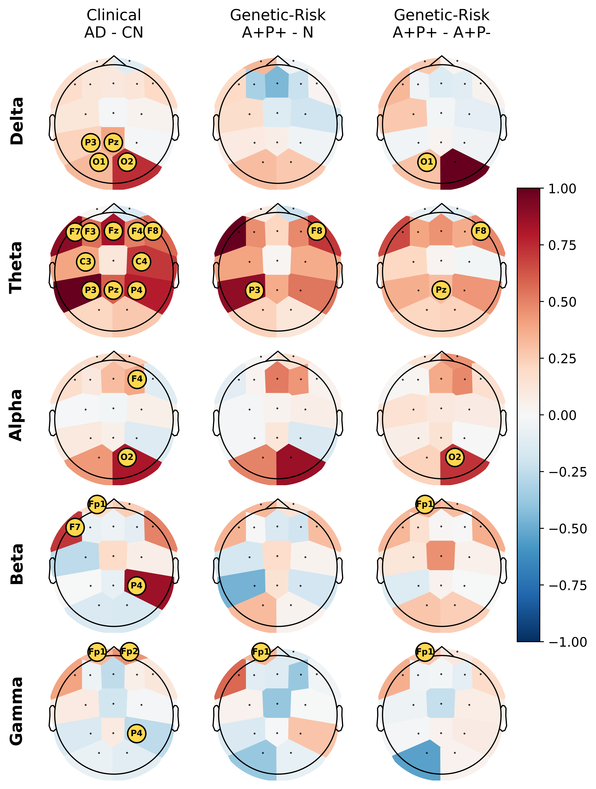

# AD DiffLogic Transfer

This repository contains code for EEG-based Alzheimer's disease transfer learning with Differentiable Logic Gate Networks (DiffLogic).

The analysis trains an AD versus cognitively normal control model on a clinical resting-state EEG dataset and applies the trained model to PEARL without retraining. In PEARL, the model output is treated as an AD-like EEG score and compared across biomarker/genetic-risk groups. These scores are research outputs and should not be interpreted as clinical diagnoses.

## Overview

The core pipeline includes:

- harmonized EEG preprocessing for the clinical source dataset and PEARL;
- strict common-channel selection before average referencing;
- Welch power spectral density (PSD) feature extraction;
- relative bandpower conversion and fold-specific feature scaling;
- subject-stratified DiffLogic training on AD versus control;
- matched PyTorch baseline training;
- direct PEARL transfer inference;
- PEARL group statistics and age/sex covariate checks;
- model relevance analysis with gradient-based attribution.

## Repository Structure

```text
src/
  preprocessing.py                 # EEG preprocessing
  feature_extraction_psd.py         # Welch PSD extraction
  train_helpers.py                  # feature loading, folds, scaling, encoding
  difflogic_model.py                # DiffLogic model definitions
  baseline_models.py                # MLP, 1D-CNN, and Transformer baselines
  train_difflogic.py                # training and PEARL transfer inference
  interpret_difflogic_gradients.py  # model relevance analysis
  statistical_analysis_psd.py       # PSD statistics
  analyze_pearl_covariates.py       # age/sex adjusted PEARL analysis
  model_relevance_statistics.py     # relevance summary statistics
  plot_transfer_relevance_contrast_topomaps.py
                                    # clinical-to-PEARL relevance topomaps
  make_45hz_benchmark_tables.py     # 45 Hz benchmark-consistent manuscript tables
  summarize_difflogic_runs.py       # multi-seed DiffLogic summaries
```

Large datasets, model outputs, logs, and most generated figures are not tracked by Git:

```text
datasets/
outputs/
logs/
figures/
```

Representative figures can be written to `figures/` for manuscript use:

```text
figures/45hz_benchmark_250k/source_target_integrated_gradient_contrasts_relative_by_contrast_nearest_p010.png
```

## Installation

Create an environment and install dependencies:

```bash
python -m venv .venv
source .venv/bin/activate
pip install --upgrade pip
pip install -r requirements.txt
```

DiffLogic uses PyTorch. For GPU support, install the PyTorch build that matches the local CUDA version.

## Data Layout

Place local datasets under:

```text
datasets/
  ALZ_FTD/
  PEARL/
```

Raw EEG data are not included in this repository.

The preprocessing uses the strict 15-channel overlap between source and target:

```text
Fp1, Fp2, F7, F3, Fz, F4, F8, C3, Cz, C4, P3, Pz, P4, O1, O2
```

Each recording is first restricted to these channels, then average-referenced over the same 15 channels. This keeps the linear channel transformation comparable across datasets.

## Running the Pipeline

Run commands from the repository root. Use `PYTHONPATH=src` so scripts can import local modules.

### 1. Preprocess EEG

```bash
PYTHONPATH=src python src/preprocessing.py
```

This writes processed epochs to:

```text
datasets/processed/ALZ_FTD/
datasets/processed/PEARL/
```

### 2. Extract PSD Features

```bash
PYTHONPATH=src python src/feature_extraction_psd.py
```

This writes PSD features to:

```text
datasets/features_psd/ALZ_FTD/
datasets/features_psd/PEARL/
```

For the 45 Hz manuscript analysis, write features to a separate folder:

```bash
PYTHONPATH=src python src/feature_extraction_psd.py \
  --output-dir datasets/features_psd_45hz
```

### 3. Train DiffLogic and Transfer to PEARL

Example medium DiffLogic model with five seeds:

```bash
for seed in 1 2 3 4 5; do
  PYTHONPATH=src python src/train_difflogic.py \
    --model-size medium \
    --output-name medium_interpretable \
    --seed "$seed" \
    --epochs 200 \
    --patience 50
done
```

Outputs are written under:

```text
outputs/difflogic/medium_interpretable/
```

Matched PyTorch baselines can be run with the same training script:

```bash
for model_kind in mlp_250k conv1d_250k transformer_250k; do
  for seed in 1 2 3 4 5; do
    PYTHONPATH=src python src/train_difflogic.py \
      --model-kind "$model_kind" \
      --output-name "${model_kind}_psd" \
      --seed "$seed" \
      --epochs 200 \
      --patience 50
  done
done
```

For the clean 45 Hz benchmark-consistent 250k analysis, use the benchmark-style DiffLogic model and the 45 Hz PSD feature folder:

```bash
for seed in 1 2 3 4 5; do
  PSD_FEATURE_DIR=datasets/features_psd_45hz PYTHONPATH=src python src/train_difflogic.py \
    --model-kind difflogic_medium \
    --output-name benchmark_250k_psd \
    --seed "$seed" \
    --epochs 200 \
    --patience 50 \
    --output-dir outputs/difflogic_45hz
done
```

The benchmark-style DiffLogic model has four logic layers, 3,906 neurons per layer, and 249,984 trainable Boolean-function logits. It is the Diff-Logic 250k model used for the 45 Hz tables.

The matched 45 Hz neural baselines are:

```bash
for model_kind in mlp_250k conv1d_250k transformer_250k; do
  for seed in 1 2 3 4 5; do
    PSD_FEATURE_DIR=datasets/features_psd_45hz PYTHONPATH=src python src/train_difflogic.py \
      --model-kind "$model_kind" \
      --output-name "${model_kind}_psd" \
      --seed "$seed" \
      --epochs 200 \
      --patience 50 \
      --output-dir outputs/difflogic_45hz
  done
done
```

### 4. Run Statistics

PSD statistics:

```bash
PYTHONPATH=src python src/statistical_analysis_psd.py
```

PEARL age/sex covariate analysis:

```bash
PYTHONPATH=src python src/analyze_pearl_covariates.py \
  --summary-dir outputs/difflogic/medium_interpretable/summary
```

For the 45 Hz benchmark-consistent run:

```bash
PYTHONPATH=src python src/summarize_difflogic_runs.py \
  --run-name benchmark_250k_psd \
  --output-dir outputs/difflogic_45hz

PYTHONPATH=src python src/analyze_pearl_covariates.py \
  --summary-dir outputs/difflogic_45hz/benchmark_250k_psd/summary

PYTHONPATH=src python src/make_45hz_benchmark_tables.py \
  --difflogic-dir outputs/difflogic_45hz \
  --output-dir outputs/model_comparison_tables_45hz_benchmark_250k
```

The generated manuscript tables are:

```text
outputs/model_comparison_tables_45hz_benchmark_250k/model_performance_transfer_table.tex
outputs/model_comparison_tables_45hz_benchmark_250k/model_transfer_contrasts_table.tex
outputs/model_comparison_tables_45hz_benchmark_250k/ols_covariates_table.tex
```

### 5. Interpret the Model

Grad x Input:

```bash
PYTHONPATH=src python src/interpret_difflogic_gradients.py \
  --run-name medium_interpretable \
  --model-size medium \
  --method grad_x_input \
  --logic-mode soft \
  --batch-size 512
```

Integrated Gradients:

```bash
PYTHONPATH=src python src/interpret_difflogic_gradients.py \
  --run-name medium_interpretable \
  --model-size medium \
  --method integrated_gradients \
  --logic-mode soft \
  --ig-steps 16 \
  --batch-size 512
```

Interpretation files are written under:

```text
outputs/difflogic/medium_interpretable/interpretation/
```

For the 45 Hz benchmark-consistent figure:

```bash
PSD_FEATURE_DIR=datasets/features_psd_45hz PYTHONPATH=src python src/interpret_difflogic_gradients.py \
  --run-name benchmark_250k_psd \
  --model-kind difflogic_medium \
  --model-size medium \
  --method integrated_gradients \
  --logic-mode soft \
  --ig-steps 16 \
  --batch-size 256 \
  --device cuda \
  --output-dir outputs/difflogic_45hz

PSD_FEATURE_DIR=datasets/features_psd_45hz PYTHONPATH=src python src/model_relevance_statistics.py \
  --interpretation-dir outputs/difflogic_45hz/benchmark_250k_psd/interpretation/soft_integrated_gradients \
  --output-dir outputs/model_relevance_statistics_45hz_benchmark_250k

PSD_FEATURE_DIR=datasets/features_psd_45hz PYTHONPATH=src python src/plot_transfer_relevance_contrast_topomaps.py \
  --run-name benchmark_250k_psd \
  --run-dir outputs/difflogic_45hz/benchmark_250k_psd \
  --model-kind difflogic_medium \
  --model-size medium \
  --target-parameters 250000 \
  --pearl-interpretation-dir outputs/difflogic_45hz/benchmark_250k_psd/interpretation/soft_integrated_gradients \
  --output-dir outputs/model_relevance_statistics_45hz_benchmark_250k \
  --figures-dir figures/45hz_benchmark_250k \
  --pearl-tests-path outputs/model_relevance_statistics_45hz_benchmark_250k/integrated_gradient_relevance_tests.csv
```

The main relative topomap figure is written to:

```text
outputs/model_relevance_statistics_45hz_benchmark_250k/source_target_integrated_gradient_contrasts_relative_by_contrast_nearest_p010.png
figures/45hz_benchmark_250k/source_target_integrated_gradient_contrasts_relative_by_contrast_nearest_p010.png
```

For this figure, column-wise normalization uses absolute extrema of 0.1215 for clinical AD--CN, 0.0272 for genetic-risk A+P+--N, and 0.0368 for genetic-risk A+P+--A+P-.

## Figures

### Source-to-Target Relevance



## Notes

All evaluation is subject-level to avoid epoch-level leakage. PEARL transfer scores quantify AD-like EEG patterns learned from the clinical source dataset; they are not diagnostic predictions.
